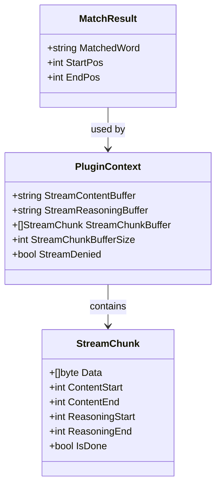
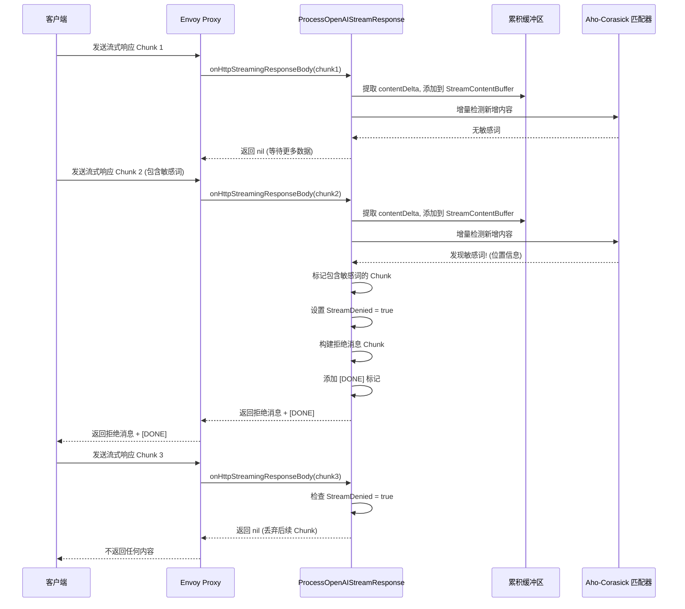

# 模型输出阶段敏感词检测流程图

## 主流程图

```mermaid
flowchart TD
    Start([接收流式响应 Chunk]) --> CheckDenied{是否已拒绝?<br/>StreamDenied}
    CheckDenied -->|是| ReturnEmpty[返回 nil, true<br/>停止处理]
    CheckDenied -->|否| InitBuffer{缓冲区是否初始化?}
    
    InitBuffer -->|否| CreateBuffer[创建缓冲区<br/>StreamChunkBuffer<br/>StreamContentBuffer<br/>StreamReasoningBuffer]
    CreateBuffer --> ParseSSE
    InitBuffer -->|是| ParseSSE
    
    ParseSSE[解析 SSE 格式<br/>按 \n\n 分割事件] --> ExtractDelta[提取 content 和 reasoning 增量<br/>从 delta 字段]
    
    ExtractDelta --> AddToBuffer[添加到累积缓冲区<br/>StreamContentBuffer += contentDelta<br/>StreamReasoningBuffer += reasoningDelta]
    
    AddToBuffer --> CheckBufferSize{缓冲区是否超过限制?<br/>默认 10KB}
    CheckBufferSize -->|是| SlidingWindow[滑动窗口机制<br/>保留最新 bufferSize 字节<br/>调整 chunk 位置索引]
    CheckBufferSize -->|否| RecordChunk
    SlidingWindow --> RecordChunk
    
    RecordChunk[记录 Chunk 信息<br/>ContentStart/End<br/>ReasoningStart/End] --> CheckProcess{是否需要处理?<br/>流结束 OR 缓冲区满}
    
    CheckProcess -->|否| IncrementalCheck[增量检测<br/>检测最后一个 chunk 的新增内容]
    IncrementalCheck --> FoundSensitive{发现敏感词?}
    FoundSensitive -->|是| SetProcess[设置 shouldProcess = true]
    FoundSensitive -->|否| WaitMore[返回 nil, false<br/>等待更多数据]
    SetProcess --> FullCheck
    
    CheckProcess -->|是| FullCheck[完整缓冲区检测]
    
    FullCheck --> MatchContent[使用 Aho-Corasick 算法<br/>匹配 StreamContentBuffer]
    FullCheck --> MatchReasoning[使用 Aho-Corasick 算法<br/>匹配 StreamReasoningBuffer]
    
    MatchContent --> GetMatches[获取所有匹配位置<br/>MatchResult: 敏感词+位置]
    MatchReasoning --> GetMatches
    
    GetMatches --> MarkChunks[标记包含敏感词的 Chunk<br/>根据位置范围判断重叠]
    
    MarkChunks --> HasSensitive{是否有敏感词?}
    
    HasSensitive -->|是| SetDenied[设置 StreamDenied = true]
    SetDenied --> BuildDenyMessage[构建拒绝消息 Chunk<br/>替换敏感词内容]
    BuildDenyMessage --> AddDone[添加 [DONE] 标记<br/>结束流]
    AddDone --> ReturnDeny[返回拒绝消息 + [DONE]]
    
    HasSensitive -->|否| ReturnNormal[返回所有正常 Chunk<br/>原样输出]
    
    ReturnDeny --> ClearBuffer[清空缓冲区]
    ReturnNormal --> ClearBuffer
    ClearBuffer --> End([结束])
    WaitMore --> End
    ReturnEmpty --> End
    
    style CheckDenied fill:#ffcccc
    style HasSensitive fill:#ffcccc
    style SetDenied fill:#ff9999
    style ReturnDeny fill:#ff6666
    style ReturnNormal fill:#ccffcc
```

## 敏感词匹配详细流程图

```mermaid
flowchart TD
    Start([开始敏感词检测]) --> GetText[获取待检测文本<br/>StreamContentBuffer<br/>或 StreamReasoningBuffer]
    
    GetText --> CheckCustom{是否有自定义敏感词?<br/>config.DenyWords}
    CheckCustom -->|是| BuildCustomMatcher[构建/获取自定义敏感词匹配器<br/>Aho-Corasick 算法<br/>带缓存机制]
    BuildCustomMatcher --> MatchCustom[匹配自定义敏感词<br/>返回匹配索引数组]
    MatchCustom --> HasCustomMatch{有匹配?}
    HasCustomMatch -->|是| FindPositions[查找所有匹配位置<br/>使用优化的字节搜索<br/>findBytesOptimized]
    HasCustomMatch -->|否| CheckSystem
    
    CheckCustom -->|否| CheckSystem{是否启用系统敏感词?<br/>config.SystemDeny}
    
    FindPositions --> AddToResults[添加到结果列表<br/>MatchResult:<br/>- MatchedWord<br/>- StartPos<br/>- EndPos]
    AddToResults --> CheckSystem
    
    CheckSystem -->|是| BuildSystemMatcher[构建/获取系统敏感词匹配器<br/>Aho-Corasick 算法<br/>带缓存机制]
    BuildSystemMatcher --> MatchSystem[匹配系统敏感词<br/>返回匹配索引数组]
    MatchSystem --> HasSystemMatch{有匹配?}
    HasSystemMatch -->|是| FindPositions2[查找所有匹配位置<br/>使用优化的字节搜索]
    HasSystemMatch -->|否| ReturnResults
    FindPositions2 --> AddToResults2[添加到结果列表]
    AddToResults2 --> ReturnResults
    
    CheckSystem -->|否| ReturnResults[返回匹配结果列表<br/>[]MatchResult]
    ReturnResults --> End([结束])
    
    style HasCustomMatch fill:#ffcccc
    style HasSystemMatch fill:#ffcccc
    style AddToResults fill:#ccffcc
    style AddToResults2 fill:#ccffcc
```

## Chunk 标记流程图

```mermaid
flowchart TD
    Start([开始标记 Chunk]) --> GetMatches[获取所有敏感词匹配结果<br/>allMatches]
    
    GetMatches --> IterateMatches[遍历每个匹配结果]
    IterateMatches --> GetChunkRange[获取匹配位置范围<br/>match.StartPos ~ match.EndPos]
    
    GetChunkRange --> IterateChunks[遍历所有 Chunk<br/>StreamChunkBuffer]
    
    IterateChunks --> GetChunkRange2[获取 Chunk 位置范围<br/>chunk.ContentStart ~ ContentEnd<br/>或 ReasoningStart ~ ReasoningEnd]
    
    GetChunkRange2 --> CheckOverlap{检查位置是否重叠?<br/>三种情况:<br/>1. 敏感词开始位置在 chunk 内<br/>2. 敏感词结束位置在 chunk 内<br/>3. 敏感词完全包含 chunk}
    
    CheckOverlap -->|是| MarkChunk[标记 Chunk<br/>deniedChunkIndices[i] = true<br/>记录日志]
    CheckOverlap -->|否| NextChunk[下一个 Chunk]
    
    MarkChunk --> NextChunk
    NextChunk --> MoreChunks{还有更多 Chunk?}
    MoreChunks -->|是| IterateChunks
    MoreChunks -->|否| MoreMatches{还有更多匹配?}
    
    MoreMatches -->|是| IterateMatches
    MoreMatches -->|否| ReturnMarked[返回标记结果<br/>deniedChunkIndices]
    
    ReturnMarked --> End([结束])
    
    style CheckOverlap fill:#ffcccc
    style MarkChunk fill:#ff9999
```

## 数据流图

```mermaid
flowchart LR
    subgraph 输入
        SSE[SSE 格式 Chunk<br/>data: {...}]
    end
    
    subgraph 解析层
        Parse[解析 JSON<br/>提取 delta.content<br/>delta.reasoning]
    end
    
    subgraph 缓冲区层
        ContentBuf[StreamContentBuffer<br/>累积所有 content]
        ReasoningBuf[StreamReasoningBuffer<br/>累积所有 reasoning]
        ChunkBuf[StreamChunkBuffer<br/>记录每个 chunk 的位置]
    end
    
    subgraph 检测层
        Incremental[增量检测<br/>实时检测新增内容]
        FullCheck[完整检测<br/>缓冲区满或流结束时]
        Matcher[Aho-Corasick<br/>多模式匹配算法]
    end
    
    subgraph 输出层
        Normal[正常 Chunk<br/>原样返回]
        Deny[拒绝消息 Chunk<br/>+ [DONE]]
    end
    
    SSE --> Parse
    Parse --> ContentBuf
    Parse --> ReasoningBuf
    Parse --> ChunkBuf
    
    ContentBuf --> Incremental
    ReasoningBuf --> Incremental
    ContentBuf --> FullCheck
    ReasoningBuf --> FullCheck
    
    Incremental --> Matcher
    FullCheck --> Matcher
    
    Matcher -->|无敏感词| Normal
    Matcher -->|有敏感词| Deny
    
    style Matcher fill:#ffcccc
    style Deny fill:#ff6666
    style Normal fill:#ccffcc
```

## 关键数据结构



## 时序图



## 关键特性说明

### 1. 滑动窗口机制
- **目的**: 限制内存使用，只保留最近的 bufferSize 字节
- **实现**: 当缓冲区超过限制时，截取最新部分，并调整所有 chunk 的位置索引

### 2. 增量检测
- **目的**: 实时检测，不等待缓冲区满
- **实现**: 每次收到新 chunk 时，立即检测新增部分

### 3. 跨 Chunk 检测
- **目的**: 识别跨越多个 chunk 的敏感词
- **实现**: 使用累积缓冲区，记录每个 chunk 的位置范围

### 4. Aho-Corasick 算法
- **优势**: 多模式匹配，一次扫描匹配所有敏感词
- **优化**: 匹配器缓存，避免重复构建

### 5. 精确位置定位
- **方法**: 通过位置范围判断敏感词与 chunk 的重叠关系
- **结果**: 精确标记包含敏感词的 chunk

